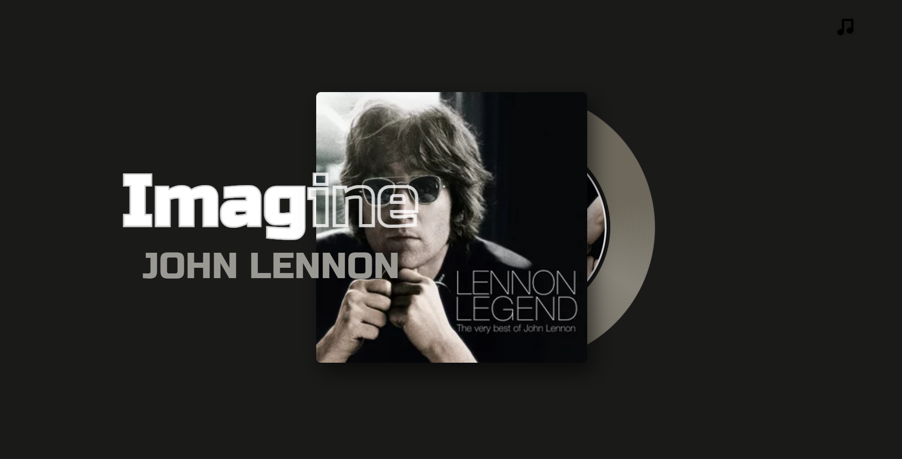

# now-playing

simply a site which shows a asthetic disc with the song's album when im playing a music in yt music :p
also the background of the web changes with the music's album theme :D

and some cool loading animation as the disc rotates when changing song and also the background first changesinto opposite color then the actual color appears!

## What you are looking at
- Uses last.fm to fetch what I'm listening to
- The track's name and track's album gets updated primarily
- You can click on the disc to show the name more clearly and the artist name!
- Also for the visitors who were unlucky enough to look at it when I was not listening can experience the same things by pressing the music like button!

# if you want to set this up for yourself
* fork this repo
* download webscrobber extension
* goto last.fm and login
* goto last.fm/api
* copy that api to app.js: const API = "`your_api`";
* copy your user to const USER = "`your_user`";
* wallahhh you have your own **now-playing**

## Built with
- native html css js
- my creativity
- a cup of coffeee
- special thanks to friends who gave suggestions

~~Congo to myself~~